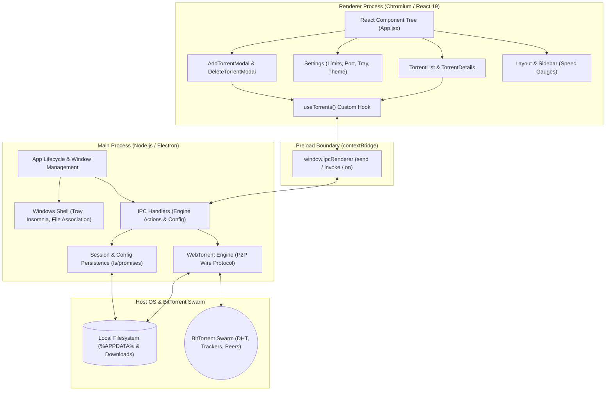

# Nexus - Windows Torrent Downloader

<div align="center">


A modern, beautiful, and feature-rich torrent client built with Electron, React, and WebTorrent.

</div>

---

## 📋 Table of Contents

- [Features](#-features)
- [Architecture](#-architecture)
- [Screenshots](#-screenshots)
- [Technology Stack](#-technology-stack)
- [Prerequisites](#-prerequisites)
- [Installation](#-installation)
- [Development](#-development)
- [Building](#-building)
- [Usage](#-usage)
- [Configuration](#-configuration)
- [Project Structure](#-project-structure)
- [Contributing](#-contributing)
- [License](#-license)

---

## ✨ Features

### Core Functionality
- **Torrent Management**: Add torrents via magnet links, `.torrent` files, or URLs — plus a built-in **Search** tab (general + movies) with per-row Download / Stream actions
- **Download Control**: Pause, resume, and remove torrents with ease
- **Swarm Health**: Peer/size/file preview with a Healthy/Fair/Weak badge before you add
- **Download Strategy**: Per-torrent Sequential (preview-friendly) vs Rarest-first piece selection
- **File Verification**: Re-verify torrent integrity to ensure data correctness
- **Session Persistence**: Automatically restore active torrents on application restart
- **Smart State Management**: Maintains download progress even when paused
- **Seeding Goals**: Auto-pause finished torrents at a target ratio or seed time
- **Disk Safety**: Free-space pre-check before adding; optional move-on-complete folder
- **Watch Folder**: Auto-add `.torrent` files dropped into a watched directory

### User Interface
- **Modern Design**: Beautiful glassmorphism UI with smooth animations
- **Dark Theme**: Eye-friendly dark mode with vibrant accent colors
- **Real-time Statistics**: Live download/upload speeds, peer counts, and progress tracking
- **Compact Mode**: Toggle between detailed and compact torrent list views
- **Custom Titlebar**: Frameless window with custom controls for a native feel

### Advanced Features
- **Live Video Streaming**: Stream a selected video from a magnet link or `.torrent` without adding it to the persistent download queue
- **Range-Request Media Server**: Supports seeking through an ephemeral localhost HTTP stream and cleans its temporary cache when stopped
- **Smart Playback**: Buffer-gated autoplay, resume position, autoplay-next-episode, and accurate buffer-ahead display
- **Subtitles**: Sidecar `.srt/.vtt/.ass` auto-served as WebVTT with sync offset, sizing, and manual upload (embedded tracks play via VLC)
- **Audio Tracks & Stats**: Multi-audio switching where supported, plus a stats-for-nerds overlay
- **Other-Device Playback**: Cast menu with copyable URLs and optional LAN sharing
- **Stream Telemetry**: Shows connected peers, transfer speed, progress, and buffer health while playback is active
- **External Player Fallback**: Open the active localhost stream in a system video player when Chromium cannot decode the file
- **System Tray Integration**: Minimize to tray and quick access from taskbar
- **Speed Limiting**: Configure download and upload speed limits, plus a daily scheduler
- **Network Configuration**: Customize torrent port settings and LAN sharing
- **Power Management**: Insomnia mode prevents system sleep during downloads
- **Notifications**: Desktop notifications for completed downloads
- **Auto-start**: Optional launch on Windows startup
- **Folder Management**: Quick access to download folders from the app

### Performance
- **Efficient Downloads**: Powered by WebTorrent for fast peer-to-peer transfers
- **Low Resource Usage**: Optimized for minimal CPU and memory footprint
- **Throttled State Saving**: Smart state persistence to avoid excessive disk writes
- **Memoized Lists**: Torrent cards skip re-renders unless display values change
- **Unit Tested**: Pure helpers (Range parsing, path containment) covered by `npm test`

---

## 🖼️ Screenshots

> Add screenshots of your application here

---

## 🛠️ Technology Stack

### Frontend
- **React 19.2.0**: Modern UI library with hooks
- **Vite 7.2.4**: Lightning-fast build tool and dev server
- **TailwindCSS 3.4.17**: Utility-first CSS framework
- **Lucide React**: Beautiful icon library
- **Recharts**: Data visualization for statistics

### Backend
- **Electron 39.2.7**: Cross-platform desktop framework
- **WebTorrent 2.8.5**: Streaming torrent client for the web
- **Node.js**: JavaScript runtime

### Build Tools
- **Electron Builder 26.0.12**: Package and build for Windows
- **ESLint**: Code linting and quality
- **PostCSS & Autoprefixer**: CSS processing

---

## 🏛️ Architecture

Nexus employs Electron's multi-process architecture with strict process isolation and secure Inter-Process Communication (IPC):



### Process Separation & Security Model

- **Main Process (`electron/main.js`)**: Runs in full Node.js context with native OS capabilities. Owns the WebTorrent client instance, background swarm listeners, disk I/O, window position/dimension persistence, file associations (`.torrent`), protocol handlers (`magnet:`), and Windows tray/power-save integrations.
- **Preload Script (`electron/preload.js`)**: Safely exposes a minimal, sanitized IPC surface to the browser via `contextBridge.exposeInMainWorld('ipcRenderer', ...)` with `contextIsolation: true` and `nodeIntegration: false`.
- **Renderer Process (`src/`)**: Pure React 19 Single Page Application running in Chromium. Renders the user interface, graphs, search filters, and themes without direct access to Node.js APIs or disk files.

### Reactive Data Flow

1. **Swarm Updates**: The WebTorrent engine maintains active peer connections, calculating instantaneous upload/download rates, piece verification, and swarm health.
2. **1-Second Polling & Diffing**: Every second, the main process gathers stats across all active and paused torrents and pushes a snapshot over the `torrents-update` IPC channel.
3. **State Reflection**: The `useTorrents` hook receives the snapshot, updating React state cleanly with zero UI stutter.
4. **Synchronous Quit Flush**: On application shutdown or window close, active progress, ratios, and configurations are atomically flushed to `%APPDATA%\nexus\nexus-config.json` before releasing system resources.

---

## 📦 Prerequisites

Before you begin, ensure you have the following installed:

- **Node.js** (v18 or higher) - [Download](https://nodejs.org/)
- **npm** (comes with Node.js) or **yarn**
- **Git** - [Download](https://git-scm.com/)
- **Windows 10/11** (for building Windows executables)

---

## 🚀 Installation

### 1. Clone the Repository

```bash
git clone https://github.com/siddarthaboddu/Nexus-Windows-Torrent-Downloader.git
cd Nexus-Windows-Torrent-Downloader
```

### 2. Install Dependencies

```bash
npm install
```

This will install all required dependencies including:
- React and React DOM
- Electron and Electron Builder
- WebTorrent
- TailwindCSS and related tools
- Development dependencies

---

## 💻 Development

### Start Development Server

Run the application in development mode with hot-reload:

```bash
npm run dev
```

This command:
- Starts the Vite dev server
- Launches Electron with the React app
- Enables hot module replacement (HMR)
- Opens DevTools automatically (in development)

### Development Features

- **Hot Reload**: Changes to React components update instantly
- **DevTools**: Full access to Chrome DevTools for debugging
- **Source Maps**: Easy debugging with original source code
- **Fast Refresh**: Preserves component state during updates

---

## 🏗️ Building

### Build for Production

Create a production build of the application:

```bash
npm run build
```

This command:
1. Builds the React app using Vite
2. Compiles Electron main process
3. Optimizes assets and bundles

### Create Windows Installer

Build a distributable Windows installer:

```bash
npm run dist
```

This command:
1. Verifies the `node-datachannel` native binary required by WebTorrent streaming
2. Runs the production build
3. Packages the app using Electron Builder
4. Creates an NSIS installer in `release/`

**Output Files:**
- `Nexus Torrent Setup {version}.exe` - Windows installer
- Unpacked application files for testing

**Installer Features:**
- Custom installation directory selection
- Start menu shortcuts
- Desktop shortcut option
- Uninstaller included

---

## 📖 Usage

### Adding Torrents

**Method 1: Magnet Link**
1. Click "Add Torrent" button
2. Paste magnet link in the input field
3. Select download destination
4. Click "Add"

**Method 2: Torrent File**
1. Click "Add Torrent" button
2. Click "Browse" to select `.torrent` file
3. Choose download location
4. Click "Add"

### Managing Downloads

- **Pause**: Click the pause icon to temporarily stop downloading
- **Resume**: Click the play icon to continue a paused download
- **Remove**: Click the trash icon to remove torrent (with option to delete files)
- **Open Folder**: Click the folder icon to open download location
- **Re-verify**: Right-click torrent and select "Verify" to check file integrity

### Streaming Video

1. Select **Stream Video** from the sidebar.
2. Paste a magnet link or drop a `.torrent` file (or pick a file from an active transfer).
3. Select a video file once its metadata loads — playback starts automatically with enough buffer.
4. Use subtitles from the CC menu (sidecar tracks, sync offset, or your own upload), the Files drawer for episodes, and **Stop & Clean Up** when finished.

Streaming uses a separate, ephemeral WebTorrent client. It does not add the torrent to the persistent downloads list unless you explicitly choose to save it (already-streamed bytes are carried over).

### Searching Torrents

Select **Search** from the sidebar, pick General or Movies, and run a query. Each row shows seeders, size, and source, with one-click **Download** (to your default folder) or **Stream** (hands the magnet to the Stream tab).

### Monitoring Progress

The dashboard displays:
- **Active Downloads**: Number of currently downloading torrents
- **Total Download Speed**: Combined download speed across all torrents
- **Active Peers**: Total number of connected peers
- **Individual Torrent Stats**: Progress, speed, ETA, ratio, and peer count

### Settings Configuration

Access settings from the sidebar to configure:
- **Download Path**: Default download location, watch folder, and completed folder
- **Speed Limits**: Maximum download/upload speeds, plus a daily scheduler
- **Seeding Goals**: Target ratio and seed time with auto-pause
- **Network Port**: Custom port for torrent connections, LAN sharing toggle
- **UI Preferences**: Compact mode, minimize to tray
- **System Integration**: Start with Windows, notifications
- **Power Management**: Insomnia mode to prevent sleep

---

## ⚙️ Configuration

### Configuration File

Settings are stored in:
```
%APPDATA%\nexus\nexus-config.json
```

### Available Settings

```json
{
  "downloadPath": "C:\\Users\\YourName\\Downloads\\Nexus",
  "downloadLimit": 0,
  "uploadLimit": 0,
  "networkPort": null,
  "minimizeToTray": true,
  "startWithWindows": false,
  "showSpeedInTray": true,
  "insomniaMode": true,
  "compactMode": false,
  "seedRatioLimit": 0,
  "seedTimeLimitMin": 0,
  "speedSchedule": { "enabled": false, "start": "22:00", "end": "08:00", "dlKB": 0, "ulKB": 0 },
  "watchFolder": "",
  "moveCompletedTo": "",
  "lanSharing": false,
  "torrents": []
}
```

**Setting Descriptions:**
- `downloadPath`: Default folder for downloads
- `downloadLimit`: Max download speed in bytes/sec (0 = unlimited)
- `uploadLimit`: Max upload speed in bytes/sec (0 = unlimited)
- `networkPort`: Custom port for connections (null = random)
- `minimizeToTray`: Close to tray instead of exiting
- `startWithWindows`: Launch on Windows startup
- `showSpeedInTray`: Display speeds in tray tooltip
- `insomniaMode`: Prevent sleep during downloads
- `compactMode`: Use compact torrent list view
- `seedRatioLimit`: Auto-pause finished torrents at this share ratio (0 = off)
- `seedTimeLimitMin`: Auto-pause finished torrents after this many seed minutes (0 = off)
- `speedSchedule`: Daily capped-speed window (`start`/`end` as HH:MM, limits in KB/s)
- `watchFolder`: Auto-add `.torrent` files dropped here ("" = off)
- `moveCompletedTo`: Move finished downloads here ("" = off)
- `lanSharing`: Bind stream server to LAN for other-device playback
- `torrents`: Saved torrent sessions

---

## 📁 Project Structure

```
nexus/
├── electron/                 # Electron main process
│   ├── main.js              # Main process entry point
│   ├── preload.js           # Preload script for IPC
│   └── utils/               # Main-process helpers
│       ├── StreamManager.js # Ephemeral streaming engine + Range server
│       ├── rangeParser.js   # Strict RFC 7233 Range parsing (tested)
│       └── safePath.js      # Download-dir containment (tested)
├── src/                     # React application source
│   ├── components/          # React components
│   │   ├── dashboard/       # Dashboard components
│   │   │   ├── TorrentList.jsx
│   │   │   ├── TorrentDetails.jsx
│   │   │   └── Settings.jsx
│   │   ├── layout/          # Layout components
│   │   │   ├── Layout.jsx
│   │   │   └── Sidebar.jsx
│   │   ├── modals/          # Modal dialogs
│   │   │   ├── AddTorrentModal.jsx
│   │   │   └── DeleteTorrentModal.jsx
│   │   ├── streaming/       # Stream tab views + cinema player
│   │   │   ├── StreamView.jsx
│   │   │   ├── StreamCinemaPlayer.jsx
│   │   │   ├── StreamFilePicker.jsx
│   │   │   ├── StreamTelemetryBar.jsx
│   │   │   └── TorrentSourceInput.jsx
│   │   └── search/          # Built-in torrent search
│   │       └── SearchView.jsx
│   ├── contexts/            # React contexts
│   ├── hooks/               # Custom React hooks
│   │   ├── useTorrents.js
│   │   └── useTorrentStream.js
│   ├── assets/              # Static assets
│   ├── App.jsx              # Main App component
│   ├── App.css              # App styles
│   ├── main.jsx             # React entry point
│   └── index.css            # Global styles
├── test/                    # node:test unit tests
│   ├── range.test.js
│   └── safepath.test.js
├── public/                  # Public assets
│   ├── tray.png            # Tray icon
│   └── icon.ico            # App icon
├── build/                   # Build resources
│   └── icon.ico            # Installer icon
├── dist/                    # Vite build output
├── dist-electron/           # Electron build output
├── release/                 # Distribution packages
├── package.json             # Project dependencies
├── vite.config.js          # Vite configuration
├── tailwind.config.js      # TailwindCSS configuration
├── postcss.config.js       # PostCSS configuration
└── README.md               # This file
```

### Key Files

- **`electron/main.js`**: Electron main process, handles IPC, WebTorrent client, system tray
- **`src/App.jsx`**: Main React component with routing and state management
- **`src/hooks/useTorrents.js`**: Custom hook for torrent operations
- **`electron/utils/StreamManager.js`**: Isolated WebTorrent streaming lifecycle, HTTP range server, and cache cleanup
- **`src/hooks/useTorrentStream.js`**: Stream metadata, playback, telemetry, and teardown state
- **`package.json`**: Dependencies and build configuration
- **`vite.config.js`**: Vite bundler configuration
- **`tailwind.config.js`**: TailwindCSS theme customization

---

## 🔧 Scripts

| Command | Description |
|---------|-------------|
| `npm run dev` | Start development server with hot reload |
| `npm run build` | Build production bundle |
| `npm run test` | Run unit tests (Range parser, path containment) |
| `npm run prepare:native` | Verify or download the node-datachannel native binary |
| `npm run dist` | Create Windows installer |
| `npm run lint` | Run ESLint code linting |
| `npm run preview` | Preview production build |

---

## 🤝 Contributing

Contributions are welcome! Please follow these steps:

1. **Fork the repository**
2. **Create a feature branch**: `git checkout -b feature/amazing-feature`
3. **Commit your changes**: `git commit -m 'Add amazing feature'`
4. **Push to the branch**: `git push origin feature/amazing-feature`
5. **Open a Pull Request**

### Development Guidelines

- Follow existing code style and conventions
- Use ESLint for code quality
- Test thoroughly before submitting PR
- Update documentation for new features
- Write clear commit messages

---

## 📝 License

This project is licensed under the MIT License - see the LICENSE file for details.

---

## 🙏 Acknowledgments

- **WebTorrent** - For the amazing torrent streaming library
- **Electron** - For making cross-platform desktop apps possible
- **React** - For the powerful UI framework
- **TailwindCSS** - For the beautiful utility-first CSS
- **Lucide** - For the clean icon set

---

## 📞 Support

If you encounter any issues or have questions:

1. Check existing [Issues](https://github.com/siddarthaboddu/Nexus-Windows-Torrent-Downloader/issues)
2. Create a new issue with detailed information
3. Include error messages and steps to reproduce

---

<div align="center">

**Made with ❤️ by [Your Name]**

⭐ Star this repo if you find it helpful!

</div>
