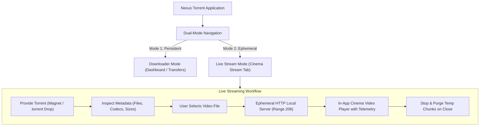
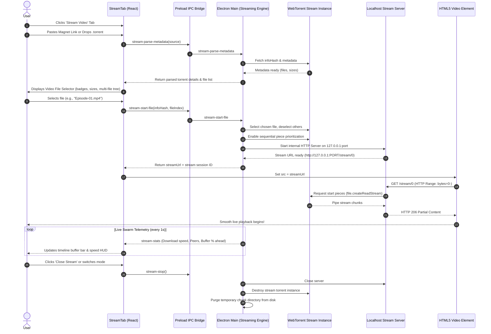
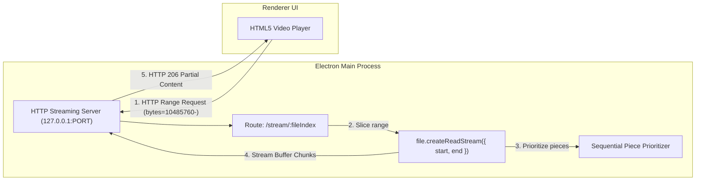
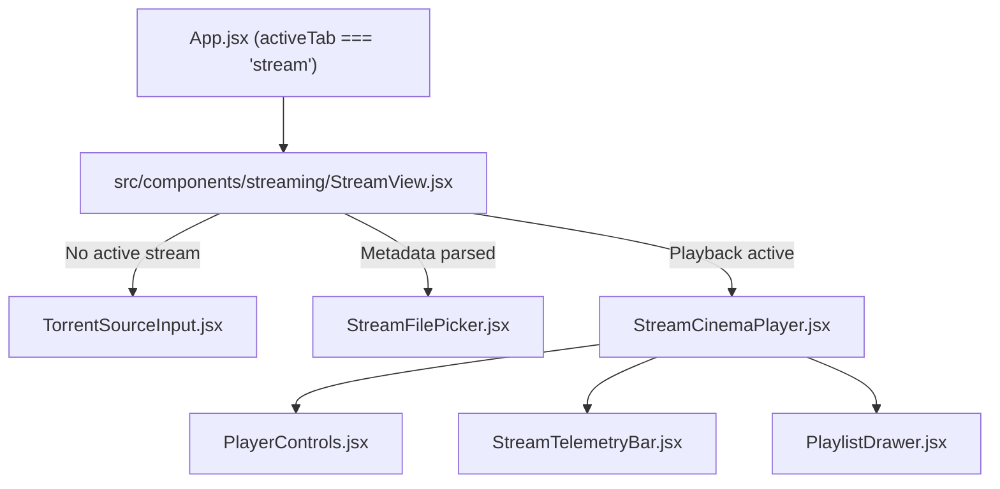

# Feature Specification & Implementation Plan: Dual-Mode Live Torrent Video Streaming

**Feature ID:** `FEAT-TORRENT-STREAM`
**Target Milestone:** v1.1.0
**Status:** Implemented
**Architecture Classification:** Dual-Mode BitTorrent Architecture (Persistent Downloader + Ephemeral Live Streamer)

---

## 1. Executive Summary & Vision

### 1.1 Problem Statement
Currently, **Nexus Torrent** operates strictly as a persistent BitTorrent downloader. When users wish to watch a video or movie distributed via BitTorrent, they must wait for the entire multi-gigabyte payload to download to disk before starting playback. This creates friction:
- High latency before content can be viewed.
- Unnecessary disk clutter when a user only wants to preview or watch content once.
- Manual navigation to local storage folders to open external video players.

### 1.2 The Solution: Dual-Mode Architecture
Nexus will introduce a dedicated **Dual-Mode** operational paradigm:
1. **Downloader Mode (Existing):** Dedicated to background, persistent swarm downloads, file management, ratio tracking, and long-term seeding.
2. **Stream Mode (New Feature):** An isolated, zero-commitment "Cinema Stream" tab that allows users to supply a magnet link or `.torrent` file, inspect the contents, pick any media file inside, and immediately watch the video while it streams sequentially from the BitTorrent swarm—without storing the entire torrent permanently.



---

## 2. Core User Experience & Workflow

### 2.1 Navigation & Tab Layout
- A new top-level navigation item is added to [`src/components/layout/Sidebar.jsx`](file:///D:/Projects/Personals/Nexus-Windows-Torrent-Downloader/src/components/layout/Sidebar.jsx):
  - **Label:** `Stream Video`
  - **Icon:** `Tv` or `Film` (from `lucide-react`)
  - **Active Tab State:** `activeTab === 'stream'`

### 2.2 User Interaction Flow



### 2.3 Detailed UI Views in Stream Mode

1. **State 1: Input & Dropzone View**
   - Clean, cinematic hero container with glassmorphic cards.
   - Magnet link input box with "Stream Now" CTA.
   - Drag-and-drop zone for `.torrent` files with animated hover states.
   - Quick option: "Stream from active downloads" allowing instant preview of any torrent currently in the Downloader queue.

2. **State 2: File Selector Modal / Card**
   - Displays torrent title, total payload size, peer count, and swarm health.
   - Filterable file list automatically highlighting recognized video formats (`.mp4`, `.mkv`, `.webm`, `.avi`, `.mov`, `.ts`).
   - Badges showing file size and format.
   - If the torrent has only 1 video file, it automatically proceeds to playback. If multi-file (e.g. TV show season or bundle), user clicks the desired file.

3. **State 3: Cinema Player View**
   - Fullscreen-capable custom video player styled with Nexus glassmorphism.
   - Custom HUD overlay:
     - **Timeline Scrubber with Dual-Progress:** Shows both playback head position and continuous buffered pieces ahead of time.
     - **Telemetry Pill:** Real-time download rate (e.g. `12.4 MB/s`), peer count (`48 peers`), and estimated buffer health (`Buffered: 4m 12s ahead`).
     - **Stream Controls:** Play/pause, 10s skip/rewind, volume slider, playback speed (0.5x to 2x), Picture-in-Picture (PiP), Fullscreen.
     - **Episode / File Switcher Drawer:** Sliding panel allowing the user to seamlessly jump to another file in the torrent without re-entering the magnet.
     - **Actions:** "Stop & Clean Up" button, and optional "Save Full Torrent to Downloads" if user decides to keep it permanently.

---

## 3. Technical Architecture & System Design

### 3.1 Separation of Concerns: Dual BitTorrent Engine
To preserve data integrity and prevent cross-contamination between persistent downloads and live streaming:
- The persistent client (`client` in [`electron/main.js`](file:///D:/Projects/Personals/Nexus-Windows-Torrent-Downloader/electron/main.js)) manages persistent downloads stored in user-designated download paths, persistent session JSON (`managedTorrents.json`), and seeding rules.
- A **Dedicated Stream Engine Instance** (`streamClient`) or an isolated, ephemeral torrent lifecycle is used for streaming:
  - **Storage Directory:** Saved inside Windows temporary directory:
    ```javascript
    path.join(app.getPath('temp'), 'nexus-stream-cache', infoHash)
    ```
  - **Deselection:** All files *except* the requested video file are explicitly deselected (`file.deselect()`) so only video pieces are downloaded from peers.
  - **Piece Strategy:** Sequential piece prioritization is activated for the selected file, ensuring pieces at the current playback position (and seeking positions) are requested with top priority.

### 3.2 Internal HTTP Media Streaming Server
Chromium's `<video>` tag requires HTTP Range requests (`bytes=start-end`) to allow instant playback and scrubbing through media timelines.



#### HTTP Server Implementation Requirements:
- **Port Assignment:** Dynamic available port on `127.0.0.1` (e.g., using `portfinder` or port `0` for OS assignment) to avoid conflict with existing services.
- **Headers:**
  - `Accept-Ranges: bytes`
  - `Content-Range: bytes ${start}-${end}/${file.length}`
  - `Content-Length: ${chunkSize}`
  - `Content-Type: ${mimeType}` (e.g. `video/mp4`, `video/webm`, `video/x-matroska`)
- **Range Request Handling:**
  - Respond with HTTP `206 Partial Content` when `req.headers.range` is present.
  - Support full file request with HTTP `200 OK` if no range header is provided.

### 3.3 Codec & Container Compatibility
Electron's bundled Chromium engine natively plays:
- **Containers:** MP4, WebM, Ogg.
- **Video Codecs:** H.264 (AVC), VP8, VP9, AV1.
- **Audio Codecs:** AAC, Opus, Vorbis, MP3, FLAC.

#### Format Handling Strategy:
1. **Direct Playback (MP4, WebM):** Directly streamed to `<video>` with standard MIME types.
2. **Matroska (MKV with H.264/AAC):** Chromium can play MKV files natively if video/audio streams are H.264 and AAC/Opus. The HTTP server serves with `Content-Type: video/x-matroska` or `video/webm`.
3. **Graceful Fallback:** If a torrent contains non-web codecs (e.g. HEVC/H.265 or DTS/AC3 audio that Chromium cannot decode without proprietary builds), provide a clear fallback button: **"Open in External Player"** (e.g. VLC / MPC-HC via `shell.openExternal(streamUrl)` or `shell.openPath()`), streaming the exact same localhost URL into VLC with zero download wait time!

### 3.4 Ephemeral Cache & Storage Lifecycle
To prevent streaming from consuming gigabytes of disk space:
1. **Temp Directory:** Stream chunks are written to `%TEMP%\nexus-stream-cache\<infoHash>`.
2. **Teardown on Stop:** When the user navigates away, clicks "Stop Stream", or closes the app:
   - The stream torrent is removed from the engine (`streamClient.remove()`).
   - The HTTP server is closed.
   - The temporary folder is asynchronously purged using `fs.rm(tempPath, { recursive: true, force: true })`.
3. **Optional Save Feature:** If the user clicks "Keep Download", Nexus seamlessly transfers the torrent from the temporary stream cache into the main `managedTorrents` queue in Downloader Mode without re-downloading existing chunks!

---

## 4. API & IPC Specification

### 4.1 Preload Bridge Additions (`electron/preload.js`)
All streaming operations will be exposed through a dedicated namespace or standardized IPC invokes:

```javascript
// Streaming IPC methods
window.ipcRenderer.invoke('stream-parse-torrent', torrentSource)
window.ipcRenderer.invoke('stream-start', { infoHash, fileIndex })
window.ipcRenderer.invoke('stream-stop')
window.ipcRenderer.invoke('stream-get-status')
window.ipcRenderer.invoke('stream-open-external', streamUrl)
window.ipcRenderer.invoke('stream-promote-to-download', { infoHash, targetPath })
```

### 4.2 Main Process IPC Handlers (`electron/main.js`)

| IPC Channel | Type | Arguments | Returns | Description |
| :--- | :--- | :--- | :--- | :--- |
| `stream-parse-torrent` | Invoke | `torrentSource: string \| Uint8Array` | `{ infoHash, name, files: [{ index, name, length, path, isVideo }] }` | Parses torrent metadata without saving to persistent queue. |
| `stream-start` | Invoke | `{ infoHash, fileIndex: number }` | `{ streamUrl, file: { name, length } }` | Configures sequential piece fetch, starts localhost HTTP stream server, returns stream URL. |
| `stream-stop` | Invoke | *none* | `{ success: boolean }` | Stops active stream, shuts down HTTP server, deletes temp cache files. |
| `stream-get-status` | Invoke | *none* | `{ downloadSpeed, uploadSpeed, numPeers, bufferedRatio, downloadedBytes }` | Real-time swarm and buffer health telemetry. |
| `stream-open-external` | Invoke | `url: string` | `{ success: boolean }` | Launches system video player (VLC, PotPlayer, MPV) pointing to localhost stream URL. |
| `stream-save-torrent` | Invoke | `{ infoHash, destinationPath }` | `{ success: boolean }` | Promotes the current stream torrent into persistent download mode. |

---

## 5. Frontend Component Architecture



### 5.1 Component Breakdown

1. **`src/components/streaming/StreamView.jsx`**:
   - Master container managing the streaming state machine:
     - `IDLE`: Displays `TorrentSourceInput`
     - `LOADING_METADATA`: Shows skeleton loader while contacting trackers/DHT
     - `SELECTING_FILE`: Displays `StreamFilePicker`
     - `STREAMING`: Displays `StreamCinemaPlayer`
     - `ERROR`: Displays error toast / recovery prompt

2. **`src/components/streaming/TorrentSourceInput.jsx`**:
   - Accepts magnet link pastes with instant validation.
   - File drag-and-drop target accepting `.torrent` files.
   - Quick-select list of any video torrents already downloading in the Downloader tab.

3. **`src/components/streaming/StreamFilePicker.jsx`**:
   - Displays all files detected inside the torrent.
   - Automatically filters and badges video files (`MP4`, `MKV`, `AVI`, `WEBM`).
   - One-click "Stream This File" button with file size indicators.

4. **`src/components/streaming/StreamCinemaPlayer.jsx`**:
   - HTML5 `<video>` element with custom controls.
   - Auto-hiding control overlays on mouse inactivity (after 2.5 seconds).
   - Glassmorphic timeline scrubber with visual buffered piece segments.
   - Keyboard shortcuts:
     - `Space` / `K`: Play/Pause
     - `Left` / `Right`: Skip 10s backward/forward
     - `Up` / `Down`: Volume control
     - `F`: Fullscreen toggle
     - `M`: Mute toggle

5. **`src/components/streaming/StreamTelemetryBar.jsx`**:
   - Live telemetry floating pill or header showing:
     - Swarm peers & seeds
     - Real-time download rate
     - Seconds/minutes of video buffered ahead of current playback position
     - Health indicator (Green = Smooth, Yellow = Buffering, Red = Low Swarm)

6. **`src/hooks/useTorrentStream.js`**:
   - Custom React hook encapsulating:
     - Polling/event listeners for stream telemetry.
     - Playback position and buffer ratio calculations.
     - Teardown on unmount or tab switch.

---

## 6. Implementation Roadmap & Milestones

### Phase 1: Core Engine & HTTP Streaming Server (`electron/`)
- [ ] Implement `StreamManager` class in `electron/utils/StreamManager.js`.
- [ ] Implement localhost HTTP server supporting HTTP 206 Range requests and mime-type detection.
- [ ] Add temporary cache management (`os.tmpdir()` / `app.getPath('temp')`) with automatic cleanup.
- [ ] Connect `StreamManager` to `electron/main.js` and register IPC handlers.

### Phase 2: Preload & React Hook
- [ ] Expose streaming IPC channels in `electron/preload.js`.
- [ ] Create `src/hooks/useTorrentStream.js` with comprehensive error handling and telemetry polling.

### Phase 3: Stream Tab & Source Selection UI
- [ ] Update `src/components/layout/Sidebar.jsx` with the new "Stream Video" tab.
- [ ] Build `src/components/streaming/StreamView.jsx` and `TorrentSourceInput.jsx`.
- [ ] Build `StreamFilePicker.jsx` with video file filtering and metadata preview.

### Phase 4: Custom Video Player & Telemetry HUD
- [ ] Build `src/components/streaming/StreamCinemaPlayer.jsx` with glassmorphic styling.
- [ ] Implement playback controls, timeline scrubbing, buffer progress bar, and keyboard shortcuts.
- [ ] Build `StreamTelemetryBar.jsx` for real-time swarm and download speed visualization.
- [ ] Add "Open in External Player" (VLC) fallback integration.

### Phase 5: Teardown, Edge Cases & Verification
- [ ] Ensure safe cleanup of stream server and temp files when navigating tabs or quitting the app.
- [ ] Handle low-peer swarms with informative UI states ("Waiting for first pieces...").
- [ ] Test seeking behavior across small and large multi-gigabyte video torrents.
- [ ] Verify zero memory leaks or dangling background processes.

---

## 7. Edge Cases & Resilience Strategies

| Scenario | Risk | Mitigation |
| :--- | :--- | :--- |
| **User seeks to unbuffered position** | Playback freezes or drops | HTTP server requests pieces at the new byte offset with immediate priority; UI shows sleek buffering spinner until target chunk arrives. |
| **Low peer count / slow swarm** | Stuttering playback | Telemetry bar warns user if download speed is lower than video bitrate; calculates minimum buffer threshold before initiating playback. |
| **Unsupported codec (e.g. H.265/HEVC)** | Black screen or audio only in Chromium | Detect unsupported codecs and provide a prominent 1-click button: *"Stream in VLC / External Player"* using the localhost stream URL. |
| **App crash or abrupt exit** | Lingering temp video chunks | Startup routine in `electron/main.js` purges orphaned directories inside `%TEMP%/nexus-stream-cache/`. |
| **User switches between tabs** | Inadvertent stream cancellation | Prompt user or keep stream playing in background with a floating mini-player / picture-in-picture mode. |

---

## 8. Summary of Files to Add & Modify

### New Files to Create:
1. `electron/utils/StreamManager.js` — WebTorrent streaming instance, sequential piece manager, HTTP 206 server, temp disk cleaner.
2. `src/components/streaming/StreamView.jsx` — Main stream view coordinator.
3. `src/components/streaming/TorrentSourceInput.jsx` — Magnet input & file dropzone.
4. `src/components/streaming/StreamFilePicker.jsx` — Media file inspection and selection modal/list.
5. `src/components/streaming/StreamCinemaPlayer.jsx` — Full-featured glassmorphism video player.
6. `src/components/streaming/StreamTelemetryBar.jsx` — Live bandwidth, peer count, and buffer indicators.
7. `src/hooks/useTorrentStream.js` — Custom React hook for stream lifecycle & telemetry.

### Existing Files to Modify:
1. `src/components/layout/Sidebar.jsx` — Add "Stream Video" navigation item and icon.
2. `src/App.jsx` — Mount `StreamView` when `activeTab === 'stream'`.
3. `electron/main.js` — Integrate `StreamManager` and wire up streaming IPC handlers.
4. `electron/preload.js` — Expose stream IPC methods to renderer context.
5. `context.md` & `README.md` — Document Dual-Mode architecture and live streaming feature.
