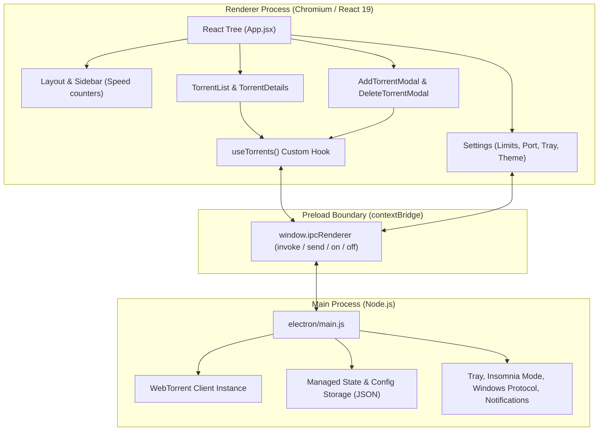

# Nexus - Windows Torrent Downloader: Project Context & Architecture Guide

## 1. Project Overview

**Nexus** is a native-feeling, high-performance Windows BitTorrent desktop client built with **Electron**, **React 19**, and **WebTorrent**. It delivers a modern, dark-mode glassmorphism experience with low system resource consumption, native Windows shell integrations (protocol association, single instance locking, taskbar tray, insomnia mode, native notifications), and robust session persistence.

- **Application Name**: Nexus Torrent (`com.nexus.torrent`)
- **Version**: 0.9.3
- **Target Platform**: Windows 10 / 11 (x64)
- **Primary Repository**: [siddarthaboddu/Nexus-Windows-Torrent-Downloader](https://github.com/siddarthaboddu/Nexus-Windows-Torrent-Downloader)

---

## 2. Technical Stack

| Layer | Technologies | Purpose |
| :--- | :--- | :--- |
| **Desktop Runtime** | Electron `^39.2.7`, Node.js (v18+) | Desktop windowing, process isolation, native APIs |
| **P2P Engine** | WebTorrent `^2.8.5` | BitTorrent engine, peer wire protocol, DHT, tracker announcements |
| **Frontend Framework** | React `^19.2.0`, ReactDOM `^19.2.0` | UI component tree, reactive state |
| **Build & Bundler** | Vite `^7.2.4`, `vite-plugin-electron` | HMR dev server, client bundle & electron main/preload bundling |
| **Styling** | TailwindCSS `^3.4.17`, PostCSS, Autoprefixer | Utility-first responsive dark glassmorphism design |
| **Icons & Visuals** | Lucide React `^0.562.0`, Recharts `^3.6.0` | Modern SVG icons, network activity graphs |
| **Packaging** | Electron Builder `^26.0.12` | NSIS assisted installer generation |

---

## 3. High-Level Architecture & Process Model

Electron splits execution into two primary spaces communicating via a secure Preload IPC bridge:



---

## 4. Directory & File Structure

```
Nexus-Windows-Torrent-Downloader/
├── build/
│   └── icon.ico                     # Windows executable and window icon
├── electron/
│   ├── main.js                      # Core Electron main process: WebTorrent engine, IPC handlers, tray, session
│   └── preload.js                   # contextBridge security bridge exposing window.ipcRenderer
├── public/
│   └── tray.png                     # System tray icon
├── release/                         # Output folder for electron-builder NSIS installers
│   └── Nexus Torrent Setup 0.9.3.exe
├── src/
│   ├── assets/                      # Static assets and icons
│   ├── components/
│   │   ├── dashboard/
│   │   │   ├── Settings.jsx         # Settings view: download paths, limits, ports, auto-start, insomnia
│   │   │   ├── TorrentDetails.jsx   # Expanded view: files list, peer/seed ratio, swarm statistics
│   │   │   └── TorrentList.jsx      # Torrent cards, progress bars, pause/resume/delete/recheck actions
│   │   ├── layout/
│   │   │   ├── Layout.jsx           # Frameless window layout and Windows top drag region
│   │   │   └── Sidebar.jsx          # Sidebar navigation with live global DL/UL throughput badges
│   │   └── modals/
│   │       ├── AddTorrentModal.jsx  # Modal for adding magnet links or .torrent files + destination folder
│   │       └── DeleteTorrentModal.jsx # Confirmation modal with toggle to delete files from disk
│   ├── contexts/
│   │   └── ThemeProvider.jsx        # Dark/Light/System theme context
│   ├── hooks/
│   │   └── useTorrents.js           # Custom hook wrapping torrent IPC calls & periodic state updates
│   ├── App.css
│   ├── App.jsx                      # Root container: tab routing, magnet URI listener, stats aggregator
│   ├── index.css                    # Tailwind imports, custom glassmorphism styles, scrollbars
│   └── main.jsx                     # Vite React bootstrap entry
├── .gitignore
├── eslint.config.js
├── index.html                       # Base HTML entry point
├── package.json                     # Dependencies, scripts, and electron-builder build config
├── postcss.config.js
├── tailwind.config.js               # Theme colors, glass-panel utilities, animations
└── vite.config.js                   # Vite config with vite-plugin-electron simple mode
```

---

## 5. Key Subsystems & Implementation Details

### 5.1 WebTorrent Lifecycle & State Synchronization
- **Dual-State Management**:
  - `client.torrents`: Active WebTorrent torrent objects actively connecting to trackers and peers.
  - `managedTorrents`: Array of metadata records (`infoHash`, `magnetURI`, `path`, `paused`, `name`, `progress`, `downloaded`, `length`, `ratio`, `files`, `done`) persisted across app restarts.
- **Paused Torrents**: WebTorrent does not natively have an efficient "pause" that stops disk/network work while keeping metadata in memory without consuming swarm sockets. Nexus destroys the active WebTorrent instance for that torrent while preserving its progress and file status in `managedTorrents`. Resuming triggers a fast resume via `client.add(magnetURI, { path })`.
- **Force Re-check (`reverify-torrent`)**: Removes the torrent from the client while keeping files on disk, then re-adds it to trigger WebTorrent's block verification algorithm against existing disk files.

### 5.2 Throttled Persistence
- Torrents state is written to `nexus-config.json` in the Electron `userData` directory.
- High-frequency download progress updates could cause disk thrashing. Nexus uses a **2-second throttle** (`SAVE_THROTTLE = 2000`) with a queued write mechanism (`saveQueued`) to ensure progress is saved consistently without disk degradation.

### 5.3 Windows OS Integration
1. **Magnet Protocol Client**:
   - Registered via `app.setAsDefaultProtocolClient('magnet')`.
   - On Windows cold start, parses `process.argv` for `magnet:`.
   - On warm start, uses `app.requestSingleInstanceLock()` and catches `app.on('second-instance')` to forward the magnet URI to the focused window without opening a second instance.
2. **Insomnia Mode (PowerSaveBlocker)**:
   - Uses Electron's `powerSaveBlocker.start('prevent-app-suspension')`.
   - Automatically activates when downloads are actively progressing and deactivates when torrents finish or pause.
3. **Frameless Window**:
   - `frame: false` with `titleBarStyle: 'hidden'` and `titleBarOverlay`.
   - Custom drag area configured in `Layout.jsx` via CSS class `.app-region-drag` (`-webkit-app-region: drag`).
4. **System Tray Integration**:
   - Single-click toggles hide/restore.
   - Shows live download and upload speeds in the tray tooltip if enabled in settings.
   - Minimizes to tray on close if `minimizeToTray` is enabled.
5. **Native Desktop Notifications**:
   - Uses native Windows toast notifications upon torrent completion with optional notification sound (`shell.beep()`).

---

## 6. IPC Communication Channel Reference

| Channel Name | Direction | Payload / Parameters | Description |
| :--- | :--- | :--- | :--- |
| `torrents-update` | Main → Renderer (Push) | `Torrent[]` | Pushed once every second with real-time stats and swarm data |
| `open-magnet-link` | Main → Renderer (Push) | `magnetLink: string` | Pushed when external magnet URI is triggered |
| `open-incoming-torrent` | Main → Renderer (Push) | `{ type: 'magnet' \| 'file', payload: string, name?: string }` | Pushed when `.torrent` file or magnet is passed via CLI, second-instance, or file association |
| `config-updated` | Main → Renderer (Push) | `Config` | Broadcast when configuration is modified |
| `get-torrents` | Renderer → Main (Invoke) | None | Returns snapshot of active and paused torrents |
| `add-torrent` | Renderer → Main (Invoke) | `torrentId: string, destPath?: string` | Adds magnet URI or .torrent file |
| `pause-torrent` | Renderer → Main (Invoke) | `infoHash: string` | Stops torrent and preserves state in managed array |
| `resume-torrent` | Renderer → Main (Invoke) | `infoHash: string` | Re-adds torrent to WebTorrent engine |
| `pause-all-torrents` | Renderer → Main (Invoke) | None | Pauses all active downloading/seeding torrents simultaneously |
| `resume-all-torrents` | Renderer → Main (Invoke) | None | Resumes all paused torrents simultaneously |
| `remove-torrent` | Renderer → Main (Invoke) | `infoHash: string, deleteData: boolean` | Deletes torrent, optionally removing files from disk |
| `reverify-torrent` | Renderer → Main (Invoke) | `infoHash: string` | Forces hash re-check of existing files on disk |
| `select-folder` | Renderer → Main (Invoke) | None | Opens Windows folder picker dialog |
| `open-torrent-folder`| Renderer → Main (Invoke) | `infoHash: string` | Opens Windows Explorer to torrent download folder |
| `get-config` | Renderer → Main (Invoke) | None | Retrieves persistent application configuration |
| `set-config` | Renderer → Main (Invoke) | `Partial<Config>` | Updates and persists application configuration |
| `get-random-port` | Renderer → Main (Invoke) | None | Generates random port between 1024 and 65535 |
| `test-notification`| Renderer → Main (Invoke) | None | Triggers a sample native notification |

---

## 7. Development & Packaging Workflow

### Prerequisites
- Node.js (v18 or higher)
- Windows 10 / 11

### Commands
```bash
# 1. Install dependencies
npm install

# 2. Run in Development Mode (Vite dev server + Electron HMR)
npm run dev

# 3. Build Bundles
npm run build

# 4. Generate Production Installer
npm run dist
```

### Packaging Details
- Uses `electron-builder` with `"npmRebuild": false` configured in `package.json` to prevent unnecessary and incompatible native rebuilds of optional C++ dependencies (`bufferutil`, `utf-8-validate`).
- The NSIS installer executable is placed in `release/Nexus Torrent Setup 0.9.3.exe`.
- Binary output is excluded from git tracking via `.gitignore` to keep git history lightweight and comply with GitHub's 100 MB hard file limit. Production binaries are distributed via **GitHub Releases**.
