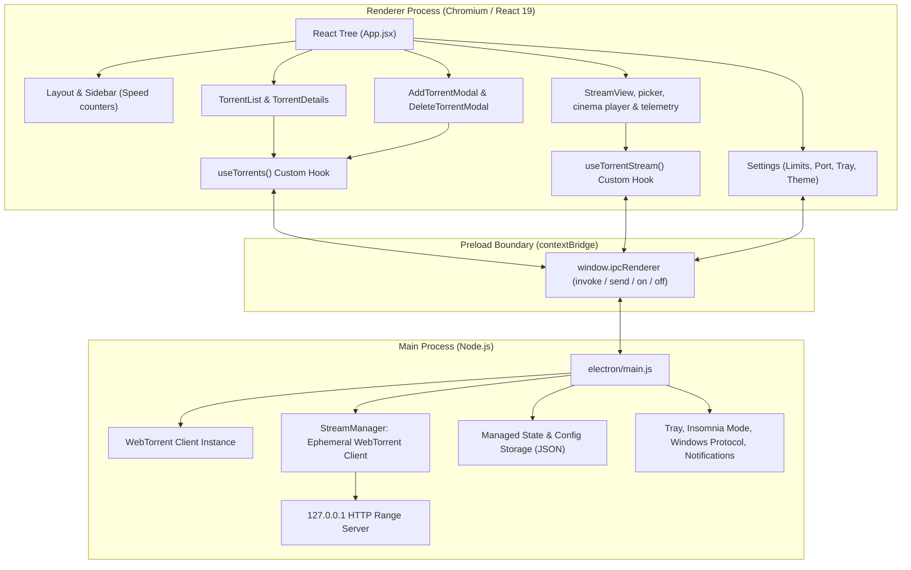

# Nexus - Windows Torrent Downloader: Project Context & Architecture Guide

## 1. Project Overview

**Nexus** is a native-feeling, high-performance Windows BitTorrent desktop client built with **Electron**, **React 19**, and **WebTorrent**. It has two isolated modes: persistent torrent downloads and ephemeral live video streaming. It delivers a modern, dark-mode glassmorphism experience with native Windows shell integrations (protocol association, single instance locking, taskbar tray, insomnia mode, native notifications), and robust session persistence.

- **Application Name**: Nexus Torrent (`com.nexus.torrent`)
- **Version**: 1.0.0
- **Target Platform**: Windows 10 / 11 (x64)
- **Primary Repository**: [siddarthaboddu/Nexus-Windows-Torrent-Downloader](https://github.com/siddarthaboddu/Nexus-Windows-Torrent-Downloader)

---

## 2. Technical Stack

| Layer | Technologies | Purpose |
| :--- | :--- | :--- |
| **Desktop Runtime** | Electron `^39.2.7`, Node.js (v18+) | Desktop windowing, process isolation, native APIs |
| **P2P Engine** | WebTorrent `^2.8.5` | BitTorrent engine, peer wire protocol, DHT, tracker announcements |
| **Frontend Framework** | React `^19.2.0`, ReactDOM `^19.2.0` | UI component tree, reactive state |
| **Build & Bundler** | Vite `^7.2.4`, `vite-plugin-electron` | HMR dev server, client bundle & electron main/preload bundling |
| **Styling** | TailwindCSS `^3.4.17`, PostCSS, Autoprefixer | Utility-first responsive dark glassmorphism design |
| **Icons & Visuals** | Lucide React `^0.562.0`, Recharts `^3.6.0` | Modern SVG icons, network activity graphs |
| **Packaging** | Electron Builder `^26.0.12` | NSIS assisted installer generation |

---

## 3. High-Level Architecture & Process Model

Electron splits execution into two primary spaces communicating via a secure Preload IPC bridge:



---

## 4. Directory & File Structure

```
Nexus-Windows-Torrent-Downloader/
├── build/
│   └── icon.ico                     # Windows executable and window icon
├── electron/
│   ├── main.js                      # Core Electron main process: WebTorrent engine, IPC handlers, tray, session
│   ├── preload.js                   # contextBridge security bridge exposing window.ipcRenderer
│   └── utils/
│       └── StreamManager.js         # Ephemeral streaming engine, Range 206 HTTP server, temp cache manager
├── public/
│   └── tray.png                     # System tray icon
├── release/                         # Output folder for electron-builder NSIS installers
│   └── Nexus Torrent Setup 1.0.0.exe
├── src/
│   ├── assets/                      # Static assets and icons
│   ├── components/
│   │   ├── dashboard/
│   │   │   ├── Settings.jsx         # Settings view: download paths, limits, ports, auto-start, insomnia
│   │   │   ├── TorrentDetails.jsx   # Expanded view: files list, peer/seed ratio, swarm statistics
│   │   │   └── TorrentList.jsx      # Torrent cards, progress bars, pause/resume/delete/recheck actions
│   │   ├── layout/
│   │   │   ├── Layout.jsx           # Frameless window layout and Windows top drag region
│   │   │   └── Sidebar.jsx          # Sidebar navigation with live global DL/UL throughput badges
│   │   ├── modals/
│   │   │   ├── AddTorrentModal.jsx  # Modal for adding magnet links or .torrent files + destination folder
│   │   │   └── DeleteTorrentModal.jsx # Confirmation modal with toggle to delete files from disk
│   │   └── streaming/
│   │       ├── StreamCinemaPlayer.jsx # In-app cinema player with custom HUD & keyboard shortcuts
│   │       ├── StreamFilePicker.jsx # Filterable video list with badges
│   │       ├── StreamTelemetryBar.jsx # Real-time bandwidth, peer count, buffer progress
│   │       ├── StreamView.jsx       # Coordinator for streaming tabs & lifecycle
│   │       └── TorrentSourceInput.jsx # Magnet input and .torrent drag & drop target
│   ├── contexts/
│   │   └── ThemeProvider.jsx        # Dark/Light/System theme context
│   ├── hooks/
│   │   ├── useTorrents.js           # Custom hook wrapping torrent IPC calls & periodic state updates
│   │   └── useTorrentStream.js      # Custom hook managing streaming lifecycle & telemetry
│   ├── App.css
│   ├── App.jsx                      # Root container: tab routing, magnet URI listener, stats aggregator
│   ├── index.css                    # Tailwind imports, custom glassmorphism styles, scrollbars
│   └── main.jsx                     # Vite React bootstrap entry
├── TORRENT_STREAMING_FEATURE.md     # Full specification for dual-mode live torrent streaming
├── .gitignore
├── eslint.config.js
├── index.html                       # Base HTML entry point
├── package.json                     # Dependencies, scripts, and electron-builder build config
├── postcss.config.js
├── tailwind.config.js               # Theme colors, glass-panel utilities, animations
└── vite.config.js                   # Vite config with vite-plugin-electron simple mode
```

---

## 5. Key Subsystems & Implementation Details

### 5.1 WebTorrent Lifecycle & State Synchronization
- **Dual-State Management**:
  - `client.torrents`: Active WebTorrent torrent objects actively connecting to trackers and peers.
  - `managedTorrents`: Array of metadata records (`infoHash`, `magnetURI`, `path`, `paused`, `name`, `progress`, `downloaded`, `length`, `ratio`, `files`, `done`) persisted across app restarts.
- **Paused Torrents**: WebTorrent does not natively have an efficient "pause" that stops disk/network work while keeping metadata in memory without consuming swarm sockets. Nexus destroys the active WebTorrent instance for that torrent while preserving its progress and file status in `managedTorrents`. Resuming triggers a fast resume via `client.add(magnetURI, { path })`.
- **Force Re-check (`reverify-torrent`)**: Removes the torrent from the client while keeping files on disk, then re-adds it to trigger WebTorrent's block verification algorithm against existing disk files.

### 5.2 Ephemeral Live Video Streaming

- **Isolation**: `StreamManager` owns a second WebTorrent client. Stream metadata, selected pieces, HTTP connections, and cache files are separate from `client` and `managedTorrents`.
- **Source and file selection**: `TorrentSourceInput` submits a magnet link or `.torrent` source to `stream-parse-torrent`. A completed managed transfer is validated against its on-disk files and takes a local-file fast path; otherwise the manager waits for swarm metadata, returns the indexed file list, and keeps the exact torrent instance that produced that list. `stream-start` uses that exact instance, preventing same-info-hash collisions with an unready persistent download.
- **Local-file fast path**: A completed paused transfer has no active WebTorrent object. Its recorded files are path-contained, stat-checked, and length-checked before the loopback range server uses native disk reads. Local playback has no swarm dependency and supports sidecar subtitles.
- **Seek-aware download scope**: Ephemeral stream torrents are created with `deselect: true`. The manager does not select the whole file: each bounded HTTP response selects only its requested pieces at priority 1, while a removable 50 MB window from the current seek point is priority 2. Skipped regions are not speculatively backfilled; a later backward seek creates its own range request. When streaming an active persistent download, its default whole-torrent selection is temporarily suspended and its selected files and original strategy are restored when streaming stops.
- **Media delivery**: A local server binds to `127.0.0.1` on an OS-selected port. It serves the selected file using bounded HTTP byte ranges (`206 Partial Content`, `Accept-Ranges`, `Content-Range`, and content-specific MIME types), so Chromium seeks without an open-ended `bytes=N-` request selecting the rest of the file. Sidecar subtitles (`.srt`, `.vtt`, `.ass/.ssa` converted to WebVTT) are served at `/subtitles/:fileIndex` and rendered as `<track>` elements with a CC menu plus manual `.srt/.vtt` upload; embedded MKV/MP4 tracks remain VLC-only.
- **Renderer lifecycle and telemetry**: `useTorrentStream` moves through `idle`, `parsing`, `ready`, `streaming`, and `error`; it polls `stream-get-status` every second only while streaming. `StreamCinemaPlayer` renders each `video.buffered` range at its actual timeline position and shows contiguous seconds ahead of the playhead. `StreamTelemetryBar` distinguishes local disk from live peers, reports connected/seeding/unchoked/queued peers, and labels aggregate piece receipt as **File cached** rather than a positional playback buffer.
- **Stop and shutdown**: `stream-stop`, app shutdown, and the next selected stream close the active HTTP server. Active main-client downloads have their prior file selections and strategy restored; ephemeral torrents are removed and their temp cache is deleted. Startup also attempts to purge abandoned stream-cache folders.
- **Known limits**: Playback depends on Chromium codec support. MP4 and WebM are the most dependable; other containers/codecs can require the external-player action. There is no transcoding.

### 5.3 Streaming UI and Public Contract

| File | Responsibility |
| :--- | :--- |
| `src/components/streaming/TorrentSourceInput.jsx` | Magnet input, `.torrent` drag/drop, and active-download source selection |
| `src/components/streaming/StreamFilePicker.jsx` | Indexed file list, video filtering, search, and stream action |
| `src/components/streaming/StreamView.jsx` | Stream-state UI, error recovery, stop, and promotion coordination |
| `src/components/streaming/StreamCinemaPlayer.jsx` | HTML5 video playback, controls, timestamp-accurate buffered ranges, keyboard shortcuts, file switching, and external-player action |
| `src/components/streaming/StreamTelemetryBar.jsx` | Transfer speed, meaningful peer metrics, aggregate cached-piece count, and stream health display |
| `src/hooks/useTorrentStream.js` | Renderer IPC calls and telemetry polling |
| `electron/utils/StreamManager.js` | Local-file fast path, ephemeral torrent lifecycle, seek-priority range server, main-download selection restoration, and cleanup |

### 5.4 Throttled Persistence
- Torrents state is written to `nexus-config.json` in the Electron `userData` directory.
- High-frequency download progress updates could cause disk thrashing. Nexus uses a **2-second throttle** (`SAVE_THROTTLE = 2000`) with a queued write mechanism (`saveQueued`) to ensure progress is saved consistently without disk degradation.

### 5.5 Windows OS Integration1. **Magnet Protocol Client**:
   - Registered via `app.setAsDefaultProtocolClient('magnet')`.
   - On Windows cold start, parses `process.argv` for `magnet:`.
   - On warm start, uses `app.requestSingleInstanceLock()` and catches `app.on('second-instance')` to forward the magnet URI to the focused window without opening a second instance.
2. **Insomnia Mode (PowerSaveBlocker)**:
   - Uses Electron's `powerSaveBlocker.start('prevent-app-suspension')`.
   - Automatically activates when downloads are actively progressing and deactivates when torrents finish or pause.
3. **Frameless Window**:
   - `frame: false` with `titleBarStyle: 'hidden'` and `titleBarOverlay`.
   - Custom drag area configured in `Layout.jsx` via CSS class `.app-region-drag` (`-webkit-app-region: drag`).
4. **System Tray Integration**:
   - Single-click toggles hide/restore.
   - Shows live download and upload speeds in the tray tooltip if enabled in settings.
   - Minimizes to tray on close if `minimizeToTray` is enabled.
5. **Native Desktop Notifications**:
   - Uses native Windows toast notifications upon torrent completion with optional notification sound (`shell.beep()`).

### 5.6 Competitor-Parity Features
- **Per-torrent strategy**: `sequential` (preview-friendly) vs `rarest` (faster completion), persisted in `managedTorrents` and applied on every re-add; toggled from TorrentDetails.
- **Seeding goals**: global target ratio and/or seed-time minutes auto-pause finished torrents with a notification (`completedAt` stamped on first sight of done).
- **Speed scheduler**: daily time window (supports overnight) with its own caps, evaluated every 30s and on config change, falling back to configured limits outside the window.
- **Watch folder**: `fs.watch` on a user folder auto-adds dropped `.torrent` files (stable-size check, archived to `processed/`).
- **Disk safety**: `add-torrent` rejects when free space < payload size (`check-disk-space`); optional completed-folder auto-move with re-seed from the new path.
- **Built-in search**: `SearchView` (General via Apibay, Movies via YTS) with per-row Download / Stream handoff to the Stream tab.
- **Other-device playback**: cinema-player Cast menu (copy URL, open externally, LAN URL via `get-lan-ip`); optional LAN sharing binds the stream server to `0.0.0.0` for the next stream.
- **Swarm health**: Add dialog reuses `stream-parse-torrent` for an early peers/size/files reading with a Healthy/Fair/Weak badge.

### 5.8 Streaming Experience
- Buffer-gated autoplay (12s contiguous or 90% buffered) with a Play-now override. Playback re-enters that gate below 3 seconds of contiguous data, preventing Chromium from repeatedly resuming on a single arriving piece.
- Resume playback per torrent+file via localStorage (long-form only); cleared on finish.
- Autoplay-next-episode with an On/Off toggle in the Files drawer.
- Accurate buffer display: contiguous-seconds-ahead chip next to the timestamp instead of file-end math.
- Subtitle sync offset (±5s, applied to live VTTCues) and S/M/L sizing in the CC menu.
- Stats-for-nerds overlay (resolution, buffer ahead, swarm, dropped frames) and multi-audio track switching where Chromium exposes `audioTracks`.
- Promote-to-download carries already-streamed bytes into the destination so the permanent download keeps verified pieces; the live stream is untouched.

### 5.7 Reliability Hardening
- `add-torrent` has a 120s metadata timeout and magnet dedup; resume/re-verify/promote paths guard against double-adds.
- HTTP Range parsing is strict RFC 7233 (`electron/utils/rangeParser.js`); CORS echoes loopback origins only; `open-external` allowlists `http(s)`.
- Renderer-supplied paths are clamped inside the download dir (`electron/utils/safePath.js`); deletes are contained; `remove-torrent` awaits swarm removal.
- Parsed-but-unstreamed torrents are evicted after 15 min; server shutdown is timeout-guarded; progress persists every 10s instead of every tick.
- `TorrentHeader` is memoized on display-rounded fields so the 1s broadcast doesn't re-render every card.
- Unit tests: `npm test` (`node --test test/`).

---

## 6. IPC Communication Channel Reference

| Channel Name | Direction | Payload / Parameters | Description |
| :--- | :--- | :--- | :--- |
| `torrents-update` | Main → Renderer (Push) | `Torrent[]` | Pushed once every second with real-time stats and swarm data |
| `open-magnet-link` | Main → Renderer (Push) | `magnetLink: string` | Pushed when external magnet URI is triggered |
| `open-incoming-torrent` | Main → Renderer (Push) | `{ type: 'magnet' \| 'file', payload: string, name?: string }` | Pushed when `.torrent` file or magnet is passed via CLI, second-instance, or file association |
| `config-updated` | Main → Renderer (Push) | `Config` | Broadcast when configuration is modified |
| `get-torrents` | Renderer → Main (Invoke) | None | Returns snapshot of active and paused torrents |
| `add-torrent` | Renderer → Main (Invoke) | `torrentId: string, destPath?: string` | Adds magnet URI or .torrent file |
| `pause-torrent` | Renderer → Main (Invoke) | `infoHash: string` | Stops torrent and preserves state in managed array |
| `resume-torrent` | Renderer → Main (Invoke) | `infoHash: string` | Re-adds torrent to WebTorrent engine |
| `pause-all-torrents` | Renderer → Main (Invoke) | None | Pauses all active downloading/seeding torrents simultaneously |
| `resume-all-torrents` | Renderer → Main (Invoke) | None | Resumes all paused torrents simultaneously |
| `remove-torrent` | Renderer → Main (Invoke) | `infoHash: string, deleteData: boolean` | Deletes torrent, optionally removing files from disk |
| `reverify-torrent` | Renderer → Main (Invoke) | `infoHash: string` | Forces hash re-check of existing files on disk |
| `select-folder` | Renderer → Main (Invoke) | None | Opens Windows folder picker dialog |
| `open-torrent-folder`| Renderer → Main (Invoke) | `infoHash: string` | Opens Windows Explorer to torrent download folder |
| `open-torrent-file`  | Renderer → Main (Invoke) | `{ infoHash: string, filePath: string }` | Directly opens specific file with native Windows default app |
| `open-torrent-file-folder` | Renderer → Main (Invoke) | `{ infoHash: string, filePath: string }` | Opens Windows Explorer highlighting the specific file |
| `show-torrent-file-menu` | Renderer → Main (Invoke) | `{ infoHash, filePath, isFolder, isSelected, fileIndex }` | Displays native Windows context menu on a file/folder |
| `show-torrent-context-menu` | Renderer → Main (Invoke) | `infoHash: string` | Displays native Windows context menu on a torrent card |
| `get-config` | Renderer → Main (Invoke) | None | Retrieves persistent application configuration |
| `set-config` | Renderer → Main (Invoke) | `Partial<Config>` | Updates and persists application configuration |
| `get-random-port` | Renderer → Main (Invoke) | None | Generates random port between 1024 and 65535 |
| `test-notification`| Renderer → Main (Invoke) | None | Triggers a sample native notification |
| `stream-parse-torrent` | Renderer → Main (Invoke) | `source: string \| Uint8Array` | Inspects torrent metadata and extracts video file list |
| `stream-start` | Renderer → Main (Invoke) | `{ infoHash: string, fileIndex: number }` | Spawns local HTTP Range 206 server and starts streaming file |
| `stream-stop` | Renderer → Main (Invoke) | None | Shuts down streaming server and purges temporary chunk cache |
| `stream-get-status` | Renderer → Main (Invoke) | None | Retrieves real-time streaming bandwidth, peers, and buffer progress |
| `stream-open-external` | Renderer → Main (Invoke) | `url: string` | Opens streaming URL in external player (e.g., VLC) |
| `stream-promote-to-download` | Renderer → Main (Invoke) | `{ destinationPath: string }` | Converts live stream torrent into permanent background download |
| `set-torrent-strategy` | Renderer → Main (Invoke) | `infoHash: string, strategy: 'sequential' \| 'rarest'` | Switches per-torrent piece selection strategy (persisted) |
| `search-torrents` | Renderer → Main (Invoke) | `{ query: string, provider: 'apibay' \| 'yts' }` | Searches public indexes, returns name/size/seeders/magnet rows |
| `get-lan-ip` | Renderer → Main (Invoke) | None | Returns first external IPv4 for other-device stream playback |

---

## 7. Development & Packaging Workflow

### Prerequisites
- Node.js (v18 or higher)
- Windows 10 / 11

### Commands
```bash
# 1. Install dependencies
npm install

# 2. Run in Development Mode (Vite dev server + Electron HMR)
npm run dev

# 3. Run unit tests (Range parser, path containment)
npm test

# 4. Build Bundles
npm run build

# 5. Verify the WebTorrent native streaming dependency when needed
npm run prepare:native

# 6. Generate Production Installer
npm run dist
```

### Packaging Details
- Uses `electron-builder` with `"npmRebuild": false` configured in `package.json` to prevent unnecessary and incompatible native rebuilds of optional C++ dependencies (`bufferutil`, `utf-8-validate`).
- WebTorrent's `node-datachannel` dependency requires `node_datachannel.node`. `npm run prepare:native` verifies that N-API binary and downloads its prebuild if the dependency install hook was blocked.
- Electron Builder explicitly unpacks `node_modules/node-datachannel/build/Release/*.node`; native modules cannot be loaded from inside `app.asar`.
- `npm run dist` runs `prepare:native` before Vite and Electron Builder, so an installer cannot be created with the known missing-binary failure.
- The NSIS installer executable is placed in `release/Nexus Torrent Setup 1.0.0.exe`.
- Binary output is excluded from git tracking via `.gitignore` to keep git history lightweight and comply with GitHub's 100 MB hard file limit. Production binaries are distributed via **GitHub Releases**.
